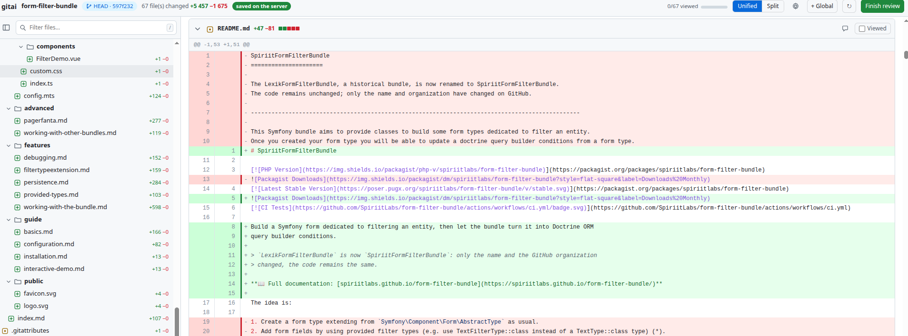
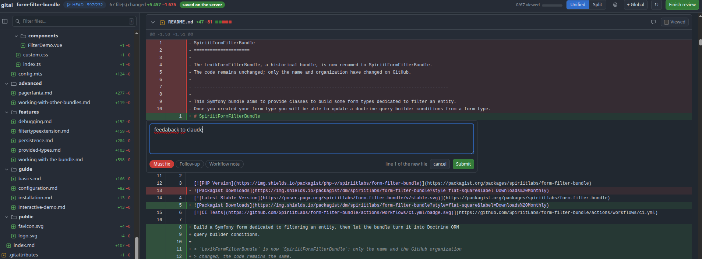

# gitai

Review a local git diff like a pull request — click a line, leave a comment — then hand the
review back to Claude Code with the protocol to apply it.

One Python script, standard library only. No service, no account, no network: the page opens
offline.



## Why

`git diff` shows the change but gives you nowhere to write. A large diff is unreadable in a
terminal, and "this line is wrong" has to be retyped into a chat.

gitai renders the diff as a page, anchors each comment to a line, and on **Finish review** writes
a `TODO.md` that Claude Code reads back. Each comment carries its kind:

| kind | what happens to it |
|---|---|
| **Must fix** | applied to the code |
| **Follow-up** | reported back, nothing written |
| **Workflow note** | recorded as a lesson about the way of working |

Claude keeps the explicit right to refuse a comment it believes is wrong, with its reason.



## Install

As a Claude Code plugin:

```
/plugin marketplace add gilles-g/gitai
/plugin install gitai@gitai
```

Then, in any repository: `/gitai:review`.

Standalone: `python3 scripts/gitai.py /path/to/repo --serve`. Requires Python 3.9+ and git.

## Usage

```bash
python3 scripts/gitai.py <repo>                 # static page, prints a file:// URL
python3 scripts/gitai.py <repo> --serve         # serve the page and collect comments
python3 scripts/gitai.py <repo> --base develop  # review a whole branch, not just the working tree
python3 scripts/gitai.py <repo> --check         # verify the parser against git diff --numstat
python3 scripts/gitai.py --list                 # review servers still alive
python3 scripts/gitai.py --stop-all             # stop them
```

Everything lands in `~/.claude/reviews/<project>/<timestamp>/`:

| file | what it is |
|---|---|
| `review.html` | the page |
| `diff.json` | the data model — the source of truth for comment anchors |
| `comments.json` | the review, rewritten atomically on every save |
| `TODO.md` | the comments grouped by file, plus how to handle them |
| `replies/<id>.json` | one reply per comment, written when they are applied |
| `done` | sentinel: the review is over |

## Guarantees

- **Your repository is never written to**, and no git write command is run — not even `add -N`.
- **No network.** CSS and JS are inlined; the page works over `file://`, where comments stay in
  the browser and can be copied as JSON.
- **The diff is frozen** at generation time and the page never auto-refreshes: a refresh would
  destroy the comment you are typing. **↻** re-collects it.
- **The server is local and locked down**: ephemeral port on `127.0.0.1`, token in a custom
  header, `Origin` and `Host` checked, bodies capped. It stops on **Finish review**, five minutes
  after the tab closes, or after an hour.

## What it handles

Untracked files and directories, staged changes, paths with spaces, quotes or non-UTF-8 bytes,
renames, `\ No newline at end of file`. Binary files, mode changes, submodules and nested
repositories degrade to a one-line notice instead of rendering empty.

An anchor is a **window**, not a line number: the commented line ±2. If the file changed since
the review, the fingerprint says so and the window is searched again — exact, `rstrip`, `strip`,
normalised whitespace — rather than trusted blindly. A comment on a deleted line cannot be
re-anchored: the hunk travels with it.

## Development

No build, no dependency. `--check` compares the parsed `+/-` against `git diff --numstat`.
CI (`.github/workflows/ci.yml`) builds a fixture repository holding every shape that once broke
the parser, runs `--check` on Python 3.9 and 3.13, verifies the assets, and drives the served
page in Chromium through Finish review.

```bash
sh .github/scripts/fixture.sh /tmp/fx
python3 scripts/gitai.py /tmp/fx/repo --check --base main
```

## Not affiliated with GitHub

gitai is not affiliated with, endorsed by, or sponsored by GitHub, Inc. The page resembles a
pull request because that is the interface reviewers already know: a hand-written approximation
inspired by [Primer](https://primer.style) (MIT), bundling no GitHub trademark, logo or asset.

## Licence

MIT — see `LICENSE`.
