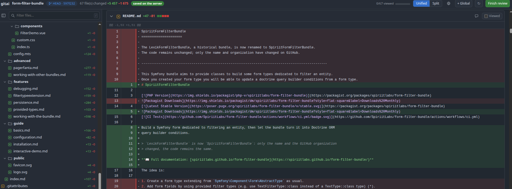

# gitai

Review a local git diff the way you review a pull request — one file at a time, one comment anchored
to one line — then hand the comments back to Claude Code with the protocol to apply them.

No service, no account, no network. A single Python script, the standard library, and a page that
opens offline.




## Why

A large diff is unreadable in a terminal, and there is no way to say *"this line is wrong"* other
than retyping it into a chat. `git diff` shows you the change; it gives you nowhere to write.

gitai renders the diff as a page, lets you click a line to comment on it, and — when you click
**Finish review** — writes the comments to disk next to a `TODO.md` explaining how they should be
handled. Claude Code reads that file and applies them, with the explicit right to refuse a comment
it believes is wrong.


A comment is not just a remark: its kind says what should happen to it. **Must fix** is applied to
the code, **Follow-up** is reported back without touching anything, **Workflow note** is a lesson
about the way of working.

## Install

As a Claude Code plugin:

```
/plugin marketplace add gilles-g/gitai
/plugin install gitai@gitai
```

Then, in any repository:

```
/gitai:review
```

Standalone, without Claude Code:

```bash
python3 scripts/gitai.py /path/to/repo --serve
```

**Requirements:** Python 3.9+ and git. No pip install, no node, no dependencies.

## Usage

```bash
python3 scripts/gitai.py <repo>                 # static page, prints a file:// URL
python3 scripts/gitai.py <repo> --serve         # serve the page and collect comments
python3 scripts/gitai.py <repo> --base develop  # review a whole branch, not just the working tree
python3 scripts/gitai.py <repo> --check         # verify the parser against git diff --numstat
python3 scripts/gitai.py --list                 # review servers still alive
python3 scripts/gitai.py --stop-all             # stop them
```

Everything lands in `~/.claude/reviews/<project>/<timestamp>/`:

| file | what it is |
|---|---|
| `review.html` | the page |
| `diff.json` | the data model — the source of truth for comment anchors |
| `comments.json` | the review, rewritten atomically on every save |
| `TODO.md` | the comments grouped by file, plus how to handle them |
| `replies/<id>.json` | one reply per comment, written when they are applied |
| `done` | sentinel: the review is over |

**gitai never writes inside your repository, and runs no git write command** — no commit, no stash,
no `add`, not even `add -N`.

## What it handles

Untracked files (enumerated with `ls-files --others`, because `git status --porcelain` folds an
untracked directory into a single entry and would silently hide the files inside it). Staged
changes (`git diff HEAD`, not `git diff`). Paths containing spaces, non-UTF-8 bytes, non-ASCII
names. Binary files, mode changes, submodules and nested repositories degrade to an honest
one-line notice instead of rendering empty. `\ No newline at end of file` does not shift the anchors.

An anchor is not a line number but a **window**: the commented line plus or minus two lines. An
isolated `}` occurs dozens of times in a file — searching for it alone finds the wrong one. If the
file changed between review and application, the fingerprint says so and the anchor is searched
again through four rungs (exact, `rstrip`, `strip`, normalised inner whitespace) rather than trusted
blindly.

Comments on **deleted** lines are supported: there is nothing to re-anchor, so the hunk travels with
the comment instead.

The page does not auto-refresh, by design: the diff is frozen at generation time and the only
mutable state belongs to you — a refresh would destroy the comment you are typing. Use
**Regenerate** to re-collect a diff that has grown.

The local server is bound to an ephemeral port on `127.0.0.1`, requires a token in a custom header
(so a third-party page triggers a preflight it cannot pass), checks `Origin` **and** `Host` (DNS
rebinding), and caps request bodies. It shuts itself down when you click Finish review, five minutes
after the tab closes, or after an hour — whichever comes first.

## Not affiliated with GitHub

**gitai is not affiliated with, endorsed by, or sponsored by GitHub, Inc.** GitHub, the GitHub logo
and the Octocat are trademarks of GitHub, Inc.

The visual design deliberately resembles a GitHub pull request because that is the interface
reviewers already know. It is a hand-written approximation inspired by
[Primer](https://primer.style), GitHub's design system, which is published under the MIT licence.
No GitHub trademark, logo or brand asset is bundled.

`assets/primer-like.css`, `assets/review.css` and `assets/render.js` are hand-written; `render.js`
is a small dependency-free syntax highlighter, not a fork of an existing library.

## Licence

MIT — see `LICENSE`.
